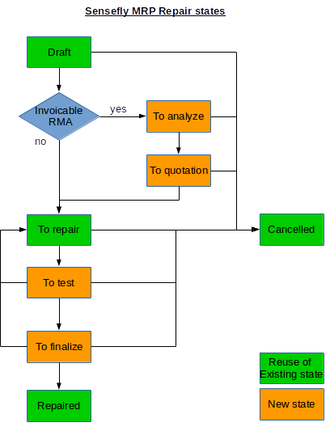

=======================
Sensefly RMA MRP Repair
=======================

This modules adds customization on the MRP Repair model in relation to RMA.

MRP Repair workflow
===================

New states are defined using model mrp.repair.stage to be displayed in a kanban
view. New workflow is as follows :

Replace type
============
a type 'Replace' on mrp.repair.line.

Operation lines of type 'Replace' will not create any stock move when the
Repair is set to done.
